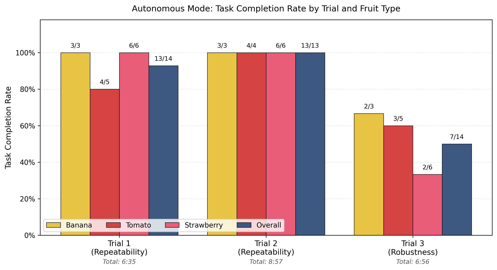
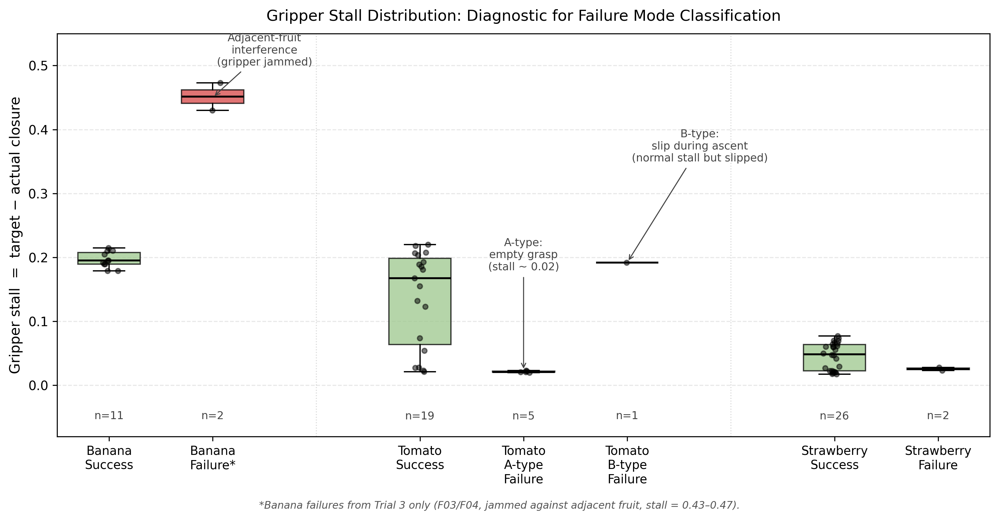

# Vision-Guided QArm Fruit Sorting System

An end-to-end robotic fruit-sorting system built with a **Quanser QArm 4-DOF manipulator** and an **Intel RealSense D415 RGB-D camera**. The system combines classical computer vision, camera-to-robot calibration, forward/inverse kinematics, time-parameterised motion, and a finite-state controller to sort bananas, tomatoes, and strawberries on physical hardware.


## Project Overview

The autonomous pipeline performs the following sequence:

1. Capture an overhead RGB-D observation.
2. Segment fruit with HSV colour thresholds, morphology, and contour features.
3. Estimate a grasp point in the QArm base frame using calibrated camera geometry.
4. Solve 4-DOF inverse kinematics and generate a rest-to-rest joint trajectory.
5. Execute approach, grasp, lift, basket placement, and recovery through a finite-state machine.

The hardware runtime is implemented in Python on the Quanser SDK. Simulink is retained as a facade and structural validation layer for the coursework deliverables; it does not run the physical control loop.

<details>
<summary>中文说明</summary>

本项目基于 **Quanser QArm 4自由度机械臂**和 **Intel RealSense D415 RGB-D相机**实现端到端水果自主分拣。系统依次完成RGB-D图像采集、HSV与轮廓特征识别、相机坐标到机械臂基坐标的转换、4自由度逆运动学、静止到静止的关节轨迹生成，以及由有限状态机驱动的接近、抓取、抬升和入筐。

真实硬件控制链路采用 Python 和 Quanser SDK 实现。Simulink用于课程要求中的架构展示与数据流验证，不承担机械臂的实时物理控制。

</details>

## Demonstration and Results

- [Final demonstration video](视频最终.mp4)
- [Trial 1 video](Test_result/auto_test_1.mp4)
- [Trial 2 video](Test_result/auto_test_2.mp4)
- [Robustness test video](Test_result/rubic_test_1.mp4)
- [Final technical report](Test_result/applied_robotics_report_FINAL.docx)



Under nominal conditions—upright, separated fruit—the two repeatability trials achieved **26/27 = 96.3% task completion**. A separate adversarial robustness trial achieved **7/14 = 50.0%**. Across all three autonomous trials, the mixed-condition aggregate was **33/41 = 80.5%**; this aggregate combines nominal and deliberately difficult placements and should not be interpreted as the nominal operating result.

<details>
<summary>中文说明</summary>

- [最终演示视频](视频最终.mp4)
- [正常实验 Trial 1](Test_result/auto_test_1.mp4)
- [正常实验 Trial 2](Test_result/auto_test_2.mp4)
- [鲁棒性压力测试 Trial 3](Test_result/rubic_test_1.mp4)
- [最终技术报告](Test_result/applied_robotics_report_FINAL.docx)

在水果保持正常朝向且彼此分离的条件下，两次重复性实验合计达到 **26/27 = 96.3%任务完成率**。单独进行的对抗性鲁棒性测试达到 **7/14 = 50.0%**。三次自主实验的混合条件总结果为 **33/41 = 80.5%**；由于该数字同时包含正常条件和故意设置的困难条件，不能将其作为正常工作条件下的性能指标。

</details>

## System Architecture

```text
RealSense D415
    │ RGB + depth
    ▼
Fruit detection ──► calibrated base-frame grasp point
    │
    ▼
4-DOF IK ──► quintic joint trajectory ──► 13-state sorting FSM
                                                   │
                                                   ▼
                                        Quanser SDK / QArm HIL
                                                   │
                                                   ▼
                                              QArm hardware

Simulink facade ── py.* bridge ──► Python algorithms and simulated FSM
```

The design separates perception, geometry, motion generation, task sequencing, and hardware I/O. This makes the algorithmic modules testable without moving the robot and keeps hardware-specific safety logic inside the driver/controller boundary.

<details>
<summary>中文说明</summary>

系统将感知、坐标转换、运动学、轨迹生成、任务状态机和硬件输入输出分层组织。D415提供彩色图像和深度信息；视觉模块输出机械臂基坐标系下的抓取点；逆运动学与五次轨迹生成器计算关节指令；13状态FSM负责任务时序；Quanser SDK最终完成QArm传感器读取与关节、夹爪命令下发。该结构便于在不驱动机械臂的情况下测试算法模块，并将硬件安全逻辑限制在驱动器和控制器边界内。

</details>

## Core Implementation

| Module | Responsibility | Implemented approach |
|---|---|---|
| [`fruit_detector.py`](python/fruit_detector.py) | Fruit detection and classification | HSV masks, morphology, contour area/aspect/circularity, calyx evidence, depth sampling |
| [`calibrate_chessboard.py`](python/calibrate_chessboard.py) | Camera/robot calibration | 7×5 chessboard, orientation sweep, `solvePnP`, reprojection and physical-consistency gates |
| [`qarm_kinematics.py`](python/qarm_kinematics.py) | QArm FK and IK | DH-based FK, analytical IK candidates, Newton–Raphson refinement and joint-limit filtering |
| [`trajectory.py`](python/trajectory.py) | Joint motion generation | Quintic rest-to-rest trajectory used by the autonomous FSM; cubic interpolation retained as a baseline/utility |
| [`sorting_controller.py`](python/sorting_controller.py) | Autonomous task sequencing | 13-state scan–approach–grasp–lift–place–recover controller |
| [`qarm_driver.py`](python/qarm_driver.py) | Hardware I/O | Quanser HIL wrapper, joint clamping, gripper commands, readback and homing |
| [`sorting_controller_sim.py`](python/sorting_controller_sim.py) | Offline/Simulink FSM twin | Deterministic time-step-driven controller with integer state output |

The kinematics validation in [`validate_python.py`](python/validate_python.py) measures an **offline FK–IK round-trip numerical error**. It is not a claim of equivalent physical Cartesian accuracy, which also depends on calibration, joint backlash, compliance, depth noise, and grasp geometry.

<details>
<summary>中文说明</summary>

- `fruit_detector.py` 使用HSV阈值、形态学处理、轮廓面积/长宽比/圆度、草莓蒂绿色特征与深度采样完成检测和分类。
- `calibrate_chessboard.py` 使用7×5棋盘格、方向遍历、`solvePnP`、重投影误差和物理一致性门限完成最终标定。
- `qarm_kinematics.py` 实现基于DH参数的正运动学、解析逆解候选、Newton–Raphson数值修正和关节限位筛选。
- `trajectory.py` 提供五次与三次轨迹；自主FSM默认使用端点速度和加速度为零的五次轨迹，三次轨迹保留为基线/工具。
- `sorting_controller.py` 实现13状态的扫描、接近、抓取、抬升、放置和恢复流程；`qarm_driver.py`封装Quanser HIL硬件接口。

`validate_python.py` 中的运动学精度是离线FK–IK往返数值误差，并不等同于真实机械臂的笛卡尔定位精度。物理精度还会受到标定误差、关节回差、结构柔顺性、深度噪声和抓取几何的影响。

</details>

## Experimental Validation

Three full autonomous experiments were conducted on physical fruit. Trials 1 and 2 measured nominal repeatability; Trial 3 deliberately challenged the assumptions used to tune perception and grasping.

| Run | Conditions | Completion | Duration | Interpretation |
|---|---|---:|---:|---|
| Trial 1 | Nominal, upright and separated fruit | **13/14 (92.9%)** | 6:35 | One strawberry empty grasp |
| Trial 2 | Nominal; one fruit absent because of a placement mistake | **13/13 (100%)** | 8:57 | All fruit present in the workspace were sorted correctly |
| Nominal baseline | Trials 1 and 2 combined | **26/27 (96.3%)** | — | Primary normal-condition result |
| Trial 3 | Deliberate adversarial placements | **7/14 (50.0%)** | 6:56 | Robustness boundary test |
| All autonomous trials | Mixed nominal and adversarial conditions | **33/41 (80.5%)** | — | Not a standalone nominal-performance metric |

Average pick-attempt cycle time was **28.2 s** in Trial 1 and **29.8 s** in Trial 2. Every fruit successfully retained by the gripper in the nominal trials was released into the correct basket.

Trial 3 used the same 14-fruit set but introduced:

- one banana and one tomato touching each other;
- inverted tomatoes;
- inverted strawberries;
- strawberries rotated more than 90° from the canonical pose.

The purpose of Trial 3 was to expose failure boundaries, not to reproduce the nominal benchmark. It showed that some moderately rotated or inverted samples could still succeed, while adjacency and strongly non-canonical strawberry poses remained unreliable.

<details>
<summary>中文说明</summary>

项目在真实水果上完成了三次完整自主实验。Trial 1和Trial 2用于评价正常条件下的重复性；Trial 3则故意破坏视觉和抓取算法所依赖的标准摆放假设。

| 实验 | 条件 | 完成率 | 用时 | 说明 |
|---|---|---:|---:|---|
| Trial 1 | 水果正常朝向、彼此分离 | **13/14 (92.9%)** | 6:35 | 一次草莓空抓 |
| Trial 2 | 正常条件；因摆放失误缺少一个水果 | **13/13 (100%)** | 8:57 | 工作区内实际存在的水果全部正确分拣 |
| 正常条件基线 | Trial 1与Trial 2合并 | **26/27 (96.3%)** | — | 主要正常条件结果 |
| Trial 3 | 故意设置的对抗性摆放 | **7/14 (50.0%)** | 6:56 | 鲁棒性边界测试 |
| 三次自主实验总体 | 混合正常与对抗条件 | **33/41 (80.5%)** | — | 不能单独代表正常性能 |

Trial 1与Trial 2的平均单次抓取尝试周期分别为 **28.2 s** 和 **29.8 s**。在两次正常实验中，所有被夹爪成功保持的水果均被放入正确果篮。

Trial 3仍使用14个水果，但加入一组香蕉与番茄相互接触、倒置番茄、倒置草莓，以及旋转超过90°的草莓。该实验用于暴露系统边界，而不是复现正常基准；结果表明部分中等旋转或倒置样本仍可能成功，但相邻水果和强非标准草莓姿态仍不可靠。

</details>

## Failure Analysis and Limitations



The physical tests revealed four main failure mechanisms:

1. **Empty grasp:** the estimated grasp point lies outside the usable contact region; the gripper closes almost completely without holding fruit.
2. **Slip during ascent:** the grasp initially appears valid, but a smooth/heavy fruit—especially a tomato—slides from the rigid fingers during lift.
3. **Adjacent-fruit interference:** the planner does not model neighbouring-object clearance, so touching fruit can produce classification errors or mechanical jamming.
4. **Non-canonical pose failure:** fixed class-specific grasp biases and hand-designed shape gates are brittle when fruit is inverted or strongly rotated.

Gripper stall values were recorded and used for post-test diagnosis, but the current autonomous controller does **not** use stall as closed-loop grasp verification. A completed place motion can therefore be logged even after an empty grasp.

The teleoperation evaluation achieved **0/12**. Source-level investigation identified two control-layer causes: Cartesian jog commands were executed through joint-space interpolation with a fixed wrist orientation, producing unintended vertical drift, and the gripper setpoint was refreshed from position readback, allowing grip slip to propagate across subsequent jog commands. Teleoperation is therefore retained as an experimental interface, not presented as a validated capability.

<details>
<summary>中文说明</summary>

真实实验暴露出四类主要问题：抓取点落在有效接触区域之外造成空抓；表面光滑且较重的水果在抬升过程中滑落；相邻水果导致误分类或夹爪机械卡滞；固定的类别偏置和手工形状门限无法稳定处理倒置或大角度旋转的水果。

系统会记录夹爪stall值并在实验后用于故障分析，但当前自主控制器**没有**利用stall进行闭环抓取确认。因此，即使发生空抓，只要机械臂完成后续放置动作，日志仍可能记录一次完成事件。

遥操作实验结果为 **0/12**。代码分析发现两个控制层原因：笛卡尔点动通过固定腕部姿态下的关节空间插值执行，造成非预期的Z方向漂移；夹爪设定值又从实际位置回读中刷新，使水果滑移在后续点动中不断累积。因此，遥操作仅作为实验性接口保留，不作为已经验证的系统能力。

</details>

## Installation and Quick Start

### Requirements

- Windows 10/11
- Python 3.13 used by the lab Quanser installation
- NumPy and OpenCV
- Quanser SDK Python API for hardware operation
- MATLAB/Simulink R2025a only for the facade models

```powershell
# Install general Python dependencies
C:\Python313\python.exe -m pip install numpy opencv-python

# Install the Quanser Python API from the local SDK installation
cd "C:\Program Files\Quanser\Quanser SDK\python"
.\install_quanser_python_api.bat
```

Run the offline validation entry point:

```powershell
cd python
C:\Python313\python.exe validate_python.py
```

Start the final calibrated autonomous pipeline and the auxiliary interfaces from the repository root:

```powershell
C:\Python313\python.exe python\main_final.py
C:\Python313\python.exe python\main_remote.py
C:\Python313\python.exe python\main_gui.py
```

[`main_autonomous.py`](python/main_autonomous.py) is an earlier configurable example with manual positions and an optional camera path; the final calibrated picker entry point is [`main_final.py`](python/main_final.py).

The hardware programs require a connected QArm, D415 camera, valid calibration data, and the Quanser SDK. Review [`ENVIRONMENT_SETUP.md`](ENVIRONMENT_SETUP.md) and [`LAB_RUNBOOK.md`](LAB_RUNBOOK.md) before operating the robot.

<details>
<summary>中文说明</summary>

硬件运行环境为Windows、实验室Quanser安装所使用的Python 3.13、NumPy、OpenCV和Quanser SDK Python API。MATLAB/Simulink R2025a只用于外观层模型。`validate_python.py`用于离线模块验证；最终标定后的自主入口为`main_final.py`，`main_remote.py`和`main_gui.py`分别启动遥操作和图形界面。`main_autonomous.py`是较早的可配置示例，支持手动坐标和可选相机路径。

硬件程序必须在QArm与D415正确连接、Quanser SDK可用且标定数据有效的条件下运行。操作机械臂前请阅读 `ENVIRONMENT_SETUP.md` 和 `LAB_RUNBOOK.md`。

</details>

## Calibration and Operation

The final calibration workflow uses a planar 7×5 inner-corner chessboard tied to the QArm workspace:

1. Establish the board pose and workspace reference with the touch-probe tools.
2. Detect chessboard corners in the D415 image.
3. Solve the camera extrinsics with `solvePnP`/IPPE candidates.
4. Apply reprojection, camera-position, and physical-distance gates.
5. Save the session calibration used by detection and base-frame projection.

Relevant entry points include [`touch_three_corners.py`](python/touch_three_corners.py), [`calibrate_chessboard.py`](python/calibrate_chessboard.py), [`calibrate_extrinsics.py`](python/calibrate_extrinsics.py), [`session_cal.py`](python/session_cal.py), and [`preflight.py`](python/preflight.py).

Safety measures include software joint-limit clamping, conservative approach/transit heights, bounded gripper commands, preflight calibration checks, and line-buffered trace logging. These measures reduce risk but do not replace supervision, an accessible emergency stop, or a cleared workspace.

<details>
<summary>中文说明</summary>

最终标定流程以固定在QArm工作区域内的7×5内角点棋盘格为基准：首先通过触碰工具确定棋盘与工作区参考，随后在D415图像中检测角点，使用 `solvePnP`/IPPE候选解求取相机外参，再通过重投影误差、相机位置和物理距离门限筛选，最后保存供检测与基坐标投影使用的会话标定数据。

软件还包含关节限位、保守的接近/转运高度、受限夹爪命令、启动前标定检查和逐行写入的轨迹日志。这些措施只能降低风险，不能替代人工监督、随时可用的急停按钮和清空后的机械臂工作区。

</details>

## Repository Structure

```text
qarm-fruit-sorting/
├── python/                  Core algorithms, hardware interfaces, tests and tools
├── matlab_code/             MATLAB algorithm counterparts
├── matlab_facade/           Simulink facade, Python bridges and model builders
├── scripts/                 Calibration, validation and report utilities
├── Test_result/             Trial videos, result figures and final report
├── figures/                 Simulation and trajectory figures
├── docs/                    Sprint reports, handoff notes, designs and plans
├── ENVIRONMENT_SETUP.md     Environment configuration
├── LAB_RUNBOOK.md           Lab operation checklist
└── README.md                Public bilingual project overview
```

For a fuller operator-oriented walkthrough, see [`COMPLETE_GUIDE.md`](COMPLETE_GUIDE.md).

<details>
<summary>中文说明</summary>

`python/`包含主要算法、硬件接口、测试和工具；`matlab_facade/`包含Simulink展示模型与Python桥接；`Test_result/`保存实验视频、结果图和最终报告；`docs/`保存迭代记录、交接文档、设计和计划。更完整的操作说明见 `COMPLETE_GUIDE.md`。

</details>

## Future Work

The test evidence suggests the following priorities:

1. Add compliant or soft fingertip surfaces to improve tomato retention.
2. Use stall thresholds and re-detection for closed-loop empty-grasp recovery.
3. Replace fixed 2D grasp offsets with depth/point-cloud-based pose estimation.
4. Train a compact detector on upright, inverted, rotated, and adjacent fruit examples.
5. Rework teleoperation with Cartesian path generation and a persistent gripper command setpoint.

<details>
<summary>中文说明</summary>

后续工作应优先包括：增加柔顺或软质指尖以提高番茄保持能力；将stall门限与重新检测接入控制器，实现空抓闭环恢复；使用深度/点云姿态估计替代固定二维抓取偏置；利用正常、倒置、旋转和相邻水果样本训练轻量检测器；采用笛卡尔路径生成和持续保持的夹爪目标值重构遥操作控制。

</details>
